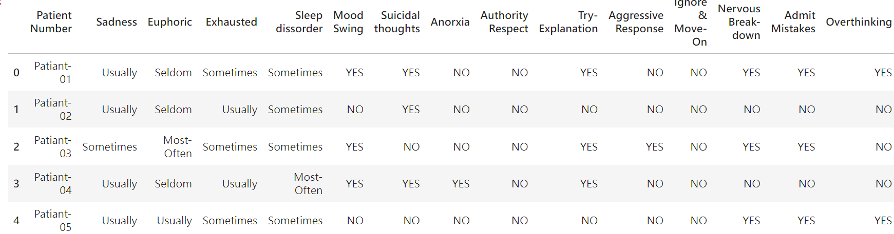
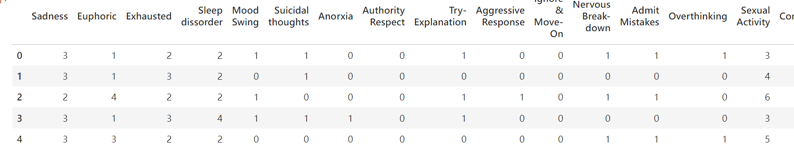
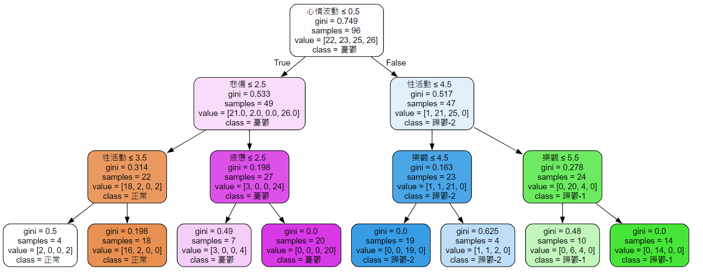

# Mental_disorder_DecisionTree
以機器學習決策樹算法，針對精神疾病的診斷資料進行研究與檢驗。比較與實際心理衡鑑、精神疾病診斷的異同。

最近在Kaggle上面，找到了有關心理疾病有關的資料集，內容是有關於身心上面的症狀，以及相對應的精神醫學診斷。

在台灣，心理師不能向精神科醫師，開立具有醫學證明的疾病診斷，但是一般在大學、研究所階段，因為心理疾病與衡鑑屬於心理學、心理治療相關的領域，也為了在往後的職涯中與其他系統合作，還是會進行精神疾病、變態心理等相關的訓練，國考的心理師證照，也要求對這門專業要有一定的掌握。

作者身為心理相關科系的畢業生，於碩士階段與大學階段，皆修習了'變態心理學'、'變態心理學研究'、'心理衡鑑研究'等等的課程。對於精神疾病與相關的衡鑑、診斷過程，有基本的了解與認識，因此想以心理學專業的視角，檢視以決策樹(Decision Tree)的方式，會如何根據當事人的症狀，進行精神疾病的診斷，進行區分的主要特徵為何? 電腦所得的結果是否和一般的心理衡鑑、臨床診斷麼模式有差異。

資料集:
https://www.kaggle.com/datasets/cid007/mental-disorder-classification/data


我們先導入資料並進行簡單的資料清洗

```python
# 導入Library
import numpy as np
import pandas as pd
```

```python
# open files
df = pd.read_csv('Dataset-Mental-Disorders.csv')
df.head()

# 印出資料集當中的columns
print(df.columns)
print(len(df.columns))
```




我們可以看到說，這個資料集包含了從Patient Number到Expert Diagnose等19個屬性。以下為詳細的19個屬性一覽，附上翻譯後面會用到。

"Patient Number": "病人編號"
"Sadness": "悲傷"
"Euphoric": "狂喜"
"Exhausted": "筋疲力盡"
"Sleep dissorder": "睡眠障礙"
"Mood Swing": "情緒波動"
"Suicidal thoughts": "自殺念頭"
"Anorxia": "厭食症狀"
"Authority Respect": "尊重權威"
"Try-Explanation": "嘗試解釋"
"Aggressive Response": "積極回應"
"Ignore & Move-On": "忽略並繼續前進"
"Nervous Break-down": "神經崩潰"
"Admit Mistakes": "承認錯誤"
"Overthinking": "過度思考"
"Sexual Activity": "性活動頻率"
"Concentration": "注意力"
"Optimisim": "樂觀主義"
"Expert Diagnose": "專家診斷"

可以看到除了第一個的病人編號之外，其他的都是有關個人症狀的描述，而最後一個"Expert Diagnose"則屬於預設的診斷結果。
除去第一個的病人編號與最後一個的專家診斷，共有17個feature可以進行預測。

```python
a=df['Expert Diagnose'].value_counts()
item_counts = pd.Series(a)
# 使用 index 屬性取得項目的名稱
item_names = item_counts.index.tolist()
print(item_names)
```
診斷結果如下，分別為: Normal無症狀、Bipolar Type-1 型1雙極情感症候群、Bipolar Type-2 型2雙極情感症候群、Depression憂鬱症。後續依據轉成0、1、2、3的label。
因為有4個Label，這會屬於多元分類問題。
```
['Bipolar Type-2', 'Depression', 'Normal', 'Bipolar Type-1']
```

資料清洗
```python
# 資料清洗 刪除病人編號
df = df.drop(columns=['Patient Number'])
cols=list(df.columns)

# 檢驗有無遺漏值 (本資料集無)
for col in cols:
    missing_values=df[col].isnull().sum()
    print(f'{col}項目的缺失值為: {missing_values}')

```

檢查特徵項目，已進行重新編碼與替換
```python
for col in cols:
    print(df[col].unique())
```
項目的描述分成3種:
行為有無: YES NO
行為頻率: Sometimes' 'Usually' 'Seldom' 'Most-Often'
行為強度: '1~10 From 10' 
其中YES NO有一行YES多一個空格需特殊處理

進行相對應的轉換與資料處理
```python
wash={
'1 From 10': 1, '2 From 10': 2, '3 From 10': 3, '4 From 10': 4, 
'5 From 10': 5, '6 From 10': 6, '7 From 10': 7, '8 From 10': 8, 
'9 From 10': 9, '10 From 10': 10,
'NO':0, 'YES':1,'YES ':1,
'Usually':3, 'Sometimes':2, 
'Seldom':1, 'Most-Often':4,
'Bipolar Type-2':2, 'Depression':3, 
'Bipolar Type-1':1, 'Normal':0,
}

# 轉換標記資料
for column in df.columns:
    df[column]= df[column].replace(wash)

# 轉換1~10頻率
temp={}
for i in range(1,11):
    temp[str(str(i)+' From 10')]=int(i)

df.head()
```


!!!實際製作當中有把清洗完成的檔案輸出已進行備份，後續開啟新的進行notebook運算，但這裡直接跳到開始訓練模型的部分

完成資料的清洗過後，我們先拆分資料以利資料訓練
80% train case
20% test case
```python
# 拆分資料
from sklearn.model_selection import train_test_split
x=df.drop(columns='Expert Diagnose')
y=df['Expert Diagnose']
train_x,val_x,train_y,val_y=train_test_split(x, y, test_size=0.2, random_state=87)
```

開始訓練模型 導入Library與設定決策樹
#Decision Tree 決策樹
決策樹是基於基尼不純度(Gini impurity)
也就是1減去某個類別比例的方式


但我更喜歡以圖示法的方式去理解

基尼不純度就是在一組sample中，抽樣2次(抽完放回母體)使得兩者為不同類別的機率。當你的資料的類別越多越雜，任抽取兩個樣本為同類的機率就越低，此時基尼不純度會越高。相反的，若樣本中只有一個類別，則不會出現不同類別的機率。
從這樣往下推導，我們可以大概理解成，基尼不純度就是1，減去母群中抽出2樣本相同類別的機率，剩下的面積就是基尼不純度。


圖片引自: https://blog.csdn.net/weixin_38753422/article/details/114609777

而決策樹就是每次的分類，都必須讓基尼不純度更低。
換句話說，就是往下每個子節點具備的類別更純粹，直到最後無法在往下進行區分，每個子節點只具備單純的類別為止。

```python
# 決策樹
from sklearn.tree import DecisionTreeClassifier
# 給定網格搜索 GridSearch + cross validation驗證
from sklearn.model_selection import GridSearchCV
```

為了找出最佳的決策樹模型，設定進行網格搜索GridSearch以調整樹的超參數
# GridSearch 
網格搜索是透過給定的超參數，去讓模型先以特定的超參數組合，去對train case進行cross validation。相當於暴力嘗試過所有的超參數組合，最後返回一個最佳的解。
好處是交叉驗證嚴謹，必定能給出設定範圍內最佳的超參數組合，也減少overfitting的風險；缺點是隨著設定的超參數組合越多，必須要計算的時間也會越長，會耗費一定的計算資源。

這個專案中，先設定常見的max_depth，min_samples_split，min_samples_leaf這三個超參數。
為了減少計算資源，這三個超參數中，都只從1~10隨機挑了幾個代表，當作超參數來進行優化。

```python
# 設定超參數的網格搜索
param_grid = {
    'max_depth': [3, 5, 7, 10],  # 樹的最大深度
    'min_samples_split': [2, 5, 10],  # 節點分裂所需的最小樣本數
    'min_samples_leaf': [1, 2, 4],  # 葉子節點所需的最小樣本數
}
```

進行Grid search 並返回最佳的超參組合
```python
# 設定決策樹模型
dctree= DecisionTreeClassifier()
# 網格搜索設定
# cross validation設定為5
grid_search = GridSearchCV(estimator=dctree, param_grid=param_grid, cv=5)

# 進行網格搜索
grid_search.fit(train_x, train_y)

# 回傳最佳參數
best_params = grid_search.best_params_
print("最佳參數:", best_params)
```
最佳參數: {'max_depth': 3, 'min_samples_leaf': 4, 'min_samples_split': 2}

利用超參數組合進行模型訓練
```python
# 最佳超參數組合初始化模型
best_dctree = DecisionTreeClassifier(**best_params)
# 開始模型訓練
best_dctree.fit(train_x, train_y)
```
答案揭曉，利用訓練完成的決策樹，對訓練資料、測試資料進行預測
```python
# 測試集
# testcase test
X=best_dctree.predict(train_x)
accuracy=accuracy_score(X, train_y)
print('訓練集預測分數:',accuracy)
```
訓練集預測分數: 0.8645833333333334
```python
# 訓練集
tree_pred_y=best_dctree.predict(val_x)
# 測試結果檢驗
accuracy=accuracy_score(tree_pred_y, val_y)
print('測試集預測分數:', accuracy)
```
測試集預測分數: 0.75

# 關於決策樹Decision Tree

畫圖
```python
from sklearn.tree import export_graphviz
import graphviz
# 將決策樹導出為Graphviz格式
feature_names=['悲傷','歡欣','疲憊',
'睡眠障礙','心情波動',
'自殺念頭','厭食症狀',
'尊重權威','嘗試解釋',
'攻擊性回應','忽略並繼續前進','神經崩潰',
'承認錯誤','過度思考','性活動',
'專注力','樂觀']
class_names=['正常','躁鬱-1','躁鬱-2','憂鬱']
dot_data = export_graphviz(best_dctree, out_file=None, 
                           feature_names=feature_names,  
                           class_names=class_names,  
                           filled=True, rounded=True,  
                           special_characters=True)


# 使用Graphviz將Graphviz格式轉換為圖片
graph = graphviz.Source(dot_data) 

# 保存圖片到文件
# graph.render("D:/desktop/disorder_decision_tree")

graph

```

根據決策樹的模型，我們得到了一個75%的結論。
相較於一般醫院由醫生先進行診斷，後續再由心理師以許多心理測驗進行心理衡鑑的評估過程，
這樣單純依照數據的分析方式可能太過於簡略，而缺少許多診間質化的資料，像是觀察當事人的言語邏輯、眼神接觸、互動方式等等。因此在本研究中，以單純的症狀資料的收集，結合機器學習的方式，去做心理疾病檢驗的，嚴謹程度是比較受限的。
不過依然可以從機器的分類方式找到一些與心理衡鑑有關的模式

# 簡單理解症狀與診斷標準
先簡易科普一下，醫學上對於精神疾病的診斷與衡鑑，是根據DSM V上的條列規則進行症狀的判斷，從而進行診斷。實際上的檢驗內容複雜且嚴謹很多，但這邊先給一個簡易的懶人包方便大家進入狀況~

型一躁鬱症：狂躁、輕躁和憂鬱的症狀
型二躁鬱症：不會有狂躁的狀況，只會在輕躁和憂鬱之間反覆

鬱症:情緒低落，對事失去興趣、性活動減低、行動遲緩，活動力下降，可能有睡眠障礙的、自殺傾向
狂躁:過度亢奮、活動力強、性活動增加、膨脹的自尊、話多、睡眠時間減少、情緒暴躁、易怒、進行高風險行為
輕躁:和狂躁症狀相似，但影響生活的程度較低，精神病症程度較低 (其實真的跟狂躁很接近，可以理解為比較弱的症狀，所以判斷上會依賴臨床的經驗與質性資料)

# 樹的分類依據
圖中的value依序為
[ 0, 1, 2, 3 ]
[無症狀,  型I雙極情感症候群, 型II雙極情感症候群, 憂鬱症]


根據決策樹的分類依據，在第一層先透過心情波動對樣本進行分類
因為躁鬱症的會有明顯的躁期，所以容易主觀感受到較強烈的心情波動。
這時樣本大概分成了左邊的 無症狀+憂鬱 右邊的 型I、II雙極情感症候群

左邊的樹主要必須歸類出憂鬱 與 無症狀兩者的分組
可以看到最主要在第二層的情緒悲傷的程度<=2.5就已經分類大致完畢了憂鬱與正常兩組樣本
情緒悲傷能成為這些樣本中，代表鬱期的主要症狀
而後續的性活動與疲憊的分類其實對結果的影響並不明顯

右邊的樹必須歸類出型I、II雙極情感症候群
但也是在第一層的性活動的頻率就大致完成分類，過高的都被丟到型I雙極情感，有83%的準確率，
剩下依然高但沒有過高的則被丟到型II雙極情感，有91%的準確率。
下一層依照樂觀程度進行分類，大致符合邏輯，因為型2會有鬱期症狀的發生，樂觀程度理應會比較低落。

# 討論
先列出之前sample當中的features，以利後續的討論
"心情波動"、"悲傷"、"狂喜"、"筋疲力盡"、"睡眠障礙"、"情緒波動"、"自殺念頭"、"厭食症狀"、"尊重權威"、"嘗試解釋"、"積極回應"、"忽略並繼續前進"、"神經崩潰"、"承認錯誤"、"過度思考"、"性活動頻率"、"注意力"、"樂觀主義"

根據機器計算的結果，在分類當中主要使用到的有
在第一層區分 (無症狀、憂鬱) 、(型I、II躁鬱) 兩組的"情緒波動"
第二層 區分 (無症狀、憂鬱)的 "悲傷" 
第二層 區分 (型I、II躁鬱)的 "性活動頻率"
僅僅用到18個features當中的3個類別，就已經完成大部分的分類

# 主要貢獻
這個測試的主要用意在於不採用心理衡鑑的技術、DSM V的標準，單純以症狀強度進行交由演算法進行分類，嘗試看看會得出怎麼樣的結果。
由結論可知，雖然說臨床上總是會把個案當成獨立的個體看待，強調質化資料的使用。
但其實大多數的個案在症狀上也都是會顯示出相近的頻率與模式，僅僅依照症狀的模式進行分類，依然歸類出了75%的樣本資料，其實證實了這四個類別的個案在症狀的表現上，其實會具備一定程度的相似性。
因此在實務的診斷當中，應當具備統計當中常態分佈的思考方式看待個體的行為頻率與模式，先進行歸類，後續再透過質化的觀察資料等來進行輔佐。
雖然和大致上的心理衡鑑訓練所強調的過程差不多，但我們更透過數據與算法實現了對症狀診斷分類的驗證。

# 與實際衡鑑診斷的標準比較
和實務的心理衡鑑與診斷進行比較，"憂鬱症"當中"自殺"會是一個很重要的指標，出現自殺的行為時，依照DSM V的標準，即會被診斷為憂鬱。
型I、II躁鬱的診斷分別，主要會集中為狂躁階段的強度，以及是否有出現"鬱期"。

實務上的診斷經歷...
未完待續...

# 研究設計限制
未完待續...
